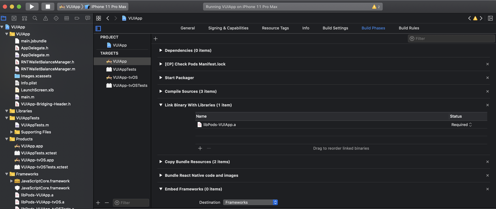
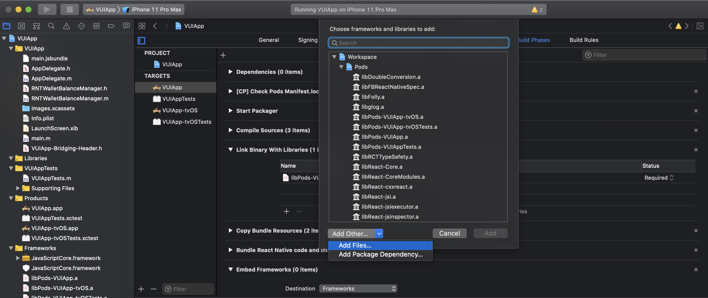
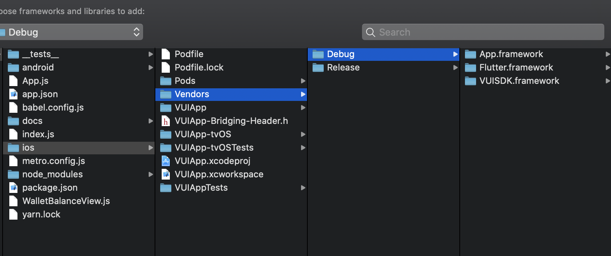
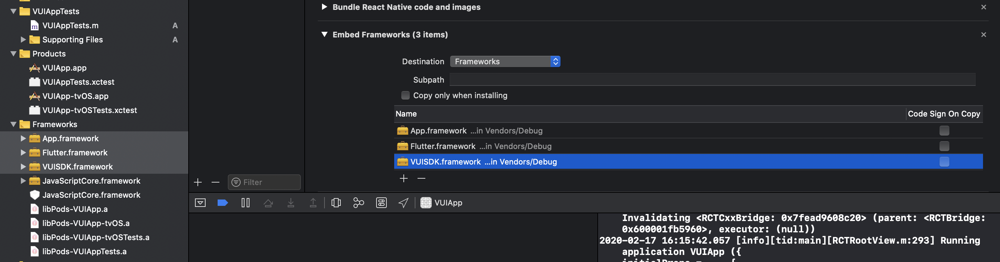
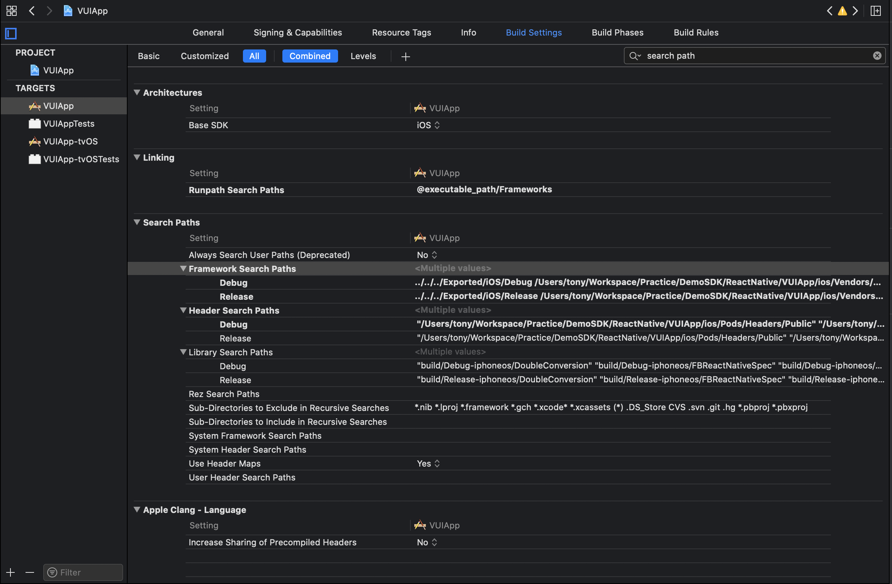
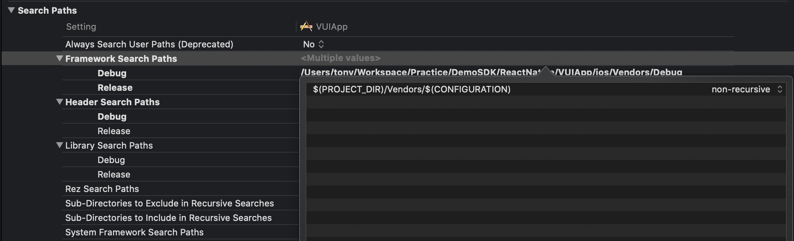

# TrueMoney SDK Demo (React native)

## Install
### iOS
***NOTE: Currently, you can add frameworks manually. We will support config automatically soon***
1. Open iOS folder in this project, you'll see `Vendors` folder that contains all TrueMoneySDK for `Debug` & `Release` mode.
2. Open `VUIAPP.xcworkspace`
3. Select `VUIAPP.xcodeproj` > `VUIAPP` target > `Build Phases` tab> `Link Binary With Libraries` > select `+` button

4. Select `Add Other` > `Add Files`

5. Route to `ios` > `Vendors` > `Debug` > select all `*.framework` files

6. Reveal `Frameworks` in left navigation bar, drag `App.framework`, `Flutter.framework`, `VUISDK.framework` files to `Embed frameworks` as below:

Then, uncheck `Code Sign On Copy` for all frameworks
7. Config `Search path` on demand build's configuration (`Debug` or `Release`)
- Select `Build settings` tab

- Edit `Framework search paths`. Replace `$(PROJECT_DIR)/Vendors/Debug` to `$(PROJECT_DIR)/Vendors/$(CONFIGURATION)`

8. Setup SDK
- Open `AppDelegate.m`
- Isserts `#import <VUISDK/VUISDK-Swift.h>`
- In `- (BOOL)application:(UIApplication *)application didFinishLaunchingWithOptions:(NSDictionary *)launchOptions` method, inserts `[TMVSDK setup];` in first line

9. Bridge to React Native
- Add `RNTWalletBalanceManager` class, inherited `RNTViewManager`
- In `RNTWalletBalanceManager.m` add this:
```Swift
@implementation RNTWalletBalanceManager
RCT_EXPORT_MODULE(RNTWalletBalance)

- (UIView *)view
{
  return [TMVSDK getBalanceView];
}

@end
```

10. Call `RNTWalletBalanceManager` component in `App.js`
- Add `WalletBalanceView.js`
```javascript
import { requireNativeComponent } from 'react-native';

// requireNativeComponent automatically resolves 'RNTWalletBalance' to 'RNTWalletBalanceManager'
module.exports = requireNativeComponent('RNTWalletBalance');
```
- Open `App.js`
```javascript
import WalletBalanceView from './WalletBalanceView.js';
```


```javascript
const App: () => React$Node = () => {
  return (
    <>
      <StatusBar barStyle="dark-content" />
      <SafeAreaView>
      <WalletBalanceView 
          style={{
            flexDirection: 'row',
            height: 100,
            backgroundColor: 'blue'
          }}/>
      </SafeAreaView>
    </>
  );
};
```


### Android (comming soon)